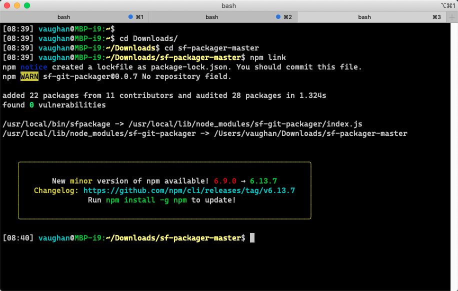

# Overview

CLI Tool to generate Salesforce.com package.xml (and destructiveChange.xml) files based on git diff between two commits or branches. 

## Prerequisite

This tool requires Node JS. Install it from here:  
https://nodejs.org/en/download/  

## Install

If you can see this page, you can install it.  
You do not require repo write access to install this tool.  

To install, using the green `Clone or download` button above, download the Zip of this repo.  
Unzip it somewhere convenient and open a terminal window in that directory. Then run  

```
npm link
```

Depending on your computer's configuration, you may need to use `sudo` to do this.



## Install for development

If you need to contribute, modify or amend this package, clone the repo (if you don't know how, try Github Desktop), and install from the cloned directory.

Command line representation here:
```
git clone https://github.ibm.com/BLUEWOLFANZ/sf-packager
cd sf-packager
npm link
```

## Usage

```
$ sfpackage destinationBranch sourceBranch ./deploy/
```

This will create a package at ./deploy/sourceBranch/unpackaged/package.xml copying all files into directory.

If any deletes occurred will also create ./deploy/sourceBranch/destructive/destructiveChanges.xml

You can force a specific version for the package.xml with the -p flag

```
sfpackage destinationBranch sourceBranch -p 42 ./deploy/
```

You can also just print the package.xml and destructiveChanges.xml by passing the -d flag

```
sfpackage destinationBranch sourceBranch -d > ~/Desktop/packageAndDestructiveChanges.xml
```

You can only include the destructive changes with the -x flag

```
sfpackage -x destinationBranch sourceBranch destructive/
```

The -s (--src) flag allows you to nominate your source root directory. This defaults to force-app.

```
sfpackage destinationBranch sourceBranch destructive/ -s src
```


You can also create "backout" content by reversing the order of the destination and source branches

```
sfpackage sourceBranch destinationBranch ./deploy/
```


## Original code

This repo is a fork from https://github.com/dlively1/sf-packager
